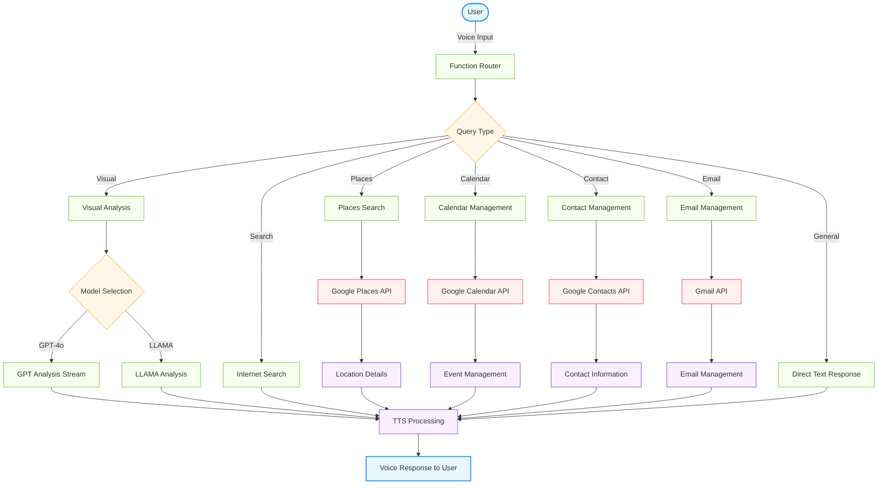

<div align="center">

# ✨ Voice & Vision Assistant for Blind ✨

### An Advanced Voice & Vision Assistant for Blind and Visually Impaired Users

*Bridging the visual gap through AI-powered assistance*

</div>

---

## 📋 Overview

Voice & Vision Assistant for Blind combines cutting-edge speech recognition, natural language processing, and computer vision to create an intuitive assistant specifically designed for blind and visually impaired users. This thoughtfully crafted solution helps users better understand their surroundings and interact with the world more confidently and independently.

---

## 🏗️ System Architecture

The system utilizes an elegant multi-component architecture to process user inputs and generate helpful responses:



---

## ✨ Key Features

### 🔄 Dual Vision Model Approach
* **People Detection First:** Llama-4-Scout-17B checks for presence of people
* **Conditional Processing:** GPT-4o for scenes without people, Llama for scenes with people
* **Privacy-Aware:** Thoughtful descriptions while respecting privacy

### 🌊 Real-time Response Streaming
* Progressive output for improved user experience
* Natural conversational flow with minimal latency
* Immediate feedback during interaction

### 👁️ Blind/Low-Vision Optimizations
* **Detailed Descriptions:** Prioritizes key elements for visually impaired users
* **Voice-First Design:** Intuitive speech interface reduces barriers
* **Concise Analysis:** Thorough yet efficient scene descriptions

### 🧩 Comprehensive Capabilities
* **Voice Interaction:** Natural conversation using speech
* **Visual Understanding:** Camera-based vision to describe surroundings
* **Internet Search:** Real-time information lookup
* **Location Search:** Find nearby businesses, restaurants, and points of interest
* **Calendar Management:** Add and view calendar events
* **Contact Management:** Find contact information from your Google Contacts
* **Email Management:** Read emails and send messages
* **Seamless Integration:** Coordinated operation between components

---

## 🔧 Technical Implementation

### Model Selection

We carefully selected `meta-llama/llama-4-scout-17b-16e-instruct` as our primary people detection model based on:

| Criteria | Performance |
|:---------|:------------|
| Response Time | TTFT < 150ms (well below 500ms requirement) |
| Batch Processing | Handles 10+ consecutive image queries without degradation |
| Streaming | Provides token-by-token streaming for responsive UX |
| People Recognition | Reliably identifies presence of people in images |
| Image Limits | 4MB (base64), 20MB (URL), multiple images supported |
| Success Rate | >95% in testing |

### Groq API Integration

The Groq API powers our Llama model implementation when people are detected in scenes:

* **⚡ Fast Processing:** Sub-500ms TTFT meets accessibility requirements
* **🧠 Advanced Models:** Leverages state-of-the-art Llama 4 Scout capabilities
* **🔌 Simple Integration:** Clean API with official Python client library

---

## 🗂️ Project Structure

```
Ally/
├── app.py                  # Main entry point
├── requirements.txt        # Dependencies
├── .env                    # Environment variables
├── images/                 # Images and diagrams
└── src/
    ├── main.py             # Entry point and agent implementation
    ├── config.py           # Configuration handling
    ├── utils.py            # Utility functions for Google API integration
    └── tools/
        ├── visual.py       # Visual processing (camera, frames, image analysis)
        ├── groq_handler.py # Groq API integration for enhanced image analysis
        ├── internet_search.py # Web search functionality
        ├── google_places.py # Places search using Google Places API
        ├── calendar.py     # Calendar integration for managing events
        └── communication.py # Contact and email management
```

---

## 🚀 Getting Started

### Prerequisites

* **Python 3.9+** - Core programming language
* **LiveKit API** - For real-time communication
* **OpenAI API** - For GPT-4o capabilities
* **Deepgram API** - For speech-to-text functionality
* **ElevenLabs API** - For text-to-speech synthesis
* **Groq API** - For fallback vision processing
* **Google APIs** - For Places, Calendar, Contacts, and Gmail functionality

### Installation

<details>
<summary><b>1. Clone the repository</b></summary>

```bash
git clone https://github.com/codingaslu/Ally-Clone-Assignment.git
cd Ally-Clone-Assignment
```
</details>

<details>
<summary><b>2. Set up environment</b></summary>

```bash
python -m venv venv
source venv/bin/activate  # On Windows: venv\Scripts\activate
pip install -U pip
pip install -r requirements.txt
```
</details>

<details>
<summary><b>3. Configure environment variables</b></summary>
   
Create a `.env` file with the following:
```
LIVEKIT_URL=your_livekit_url
LIVEKIT_API_KEY=your_livekit_key
LIVEKIT_API_SECRET=your_livekit_secret
DEEPGRAM_API_KEY=your_deepgram_key
OPENAI_API_KEY=your_openai_key
ELEVEN_API_KEY=your_elevenlabs_key

# Vision configuration
VISION_PROVIDER=groq

# Groq API configuration
GROQ_API_KEY=your_groq_api_key  # Get your API key from https://console.groq.com/keys
GROQ_MODEL_ID=meta-llama/llama-4-scout-17b-16e-instruct
   
# Google Places API configuration
GPLACES_API_KEY=your_google_places_api_key  # Get your API key from Google Cloud Console https://console.cloud.google.com/google/maps-apis/credentials
GMAIL_MAIL=your_gmail_address
GMAIL_APP_PASSWORD=your_gmail_app_password
```
</details>

<details>
<summary><b>4. Set up Google API credentials</b></summary>

1. Create a new project in the [Google Cloud Console](https://console.cloud.google.com/)
2. Enable the required APIs:
   - Google Places API Web Service
   - Google Calendar API
   - People API (Contacts)
   - Gmail API
3. Create OAuth 2.0 credentials:
   - Go to "Credentials" and click "Create Credentials" > "OAuth client ID"
   - Select "Desktop app" as the application type
   - Give it a name and click "Create"
   - Download the JSON file
4. **Important**: Rename the downloaded file to `credentials.json` and place it in the project root directory
5. Create API key for Places API:
   - Go to "Credentials" and click "Create Credentials" > "API Key"
   - Restrict the key to only the Google Places API
   - Copy this key to your `.env` file as `GPLACES_API_KEY`
6. When you first run the application and try to use calendar or email features, it will:
   - Open a browser window for authentication
   - Ask you to sign in to your Google account
   - Request permission to access your calendar, contacts, and email
   - After granting permission, it will create a `token.json` file for future use
</details>

<details>
<summary><b>5. Special Setup Instructions for Blind Users</b></summary>

### Important: One-Time Authentication Process

For blind users, the Google OAuth authentication process requires sighted assistance **only once** during initial setup:

1. **Initial Setup (One-Time with Assistance)**:
   - After installing the application, the first time you use any Google service (calendar, contacts, email), 
     the system will need authentication
   - A browser window will open with Google's authentication page
   - **This step requires sighted assistance** to complete the login and permission granting
   - The assistant should:
     - Help navigate to the URL provided in the console
     - Log in to the blind user's Google account
     - Grant the requested permissions
     - Confirm when the "Authentication successful" message appears

2. **After Initial Setup (No Assistance Needed)**:
   - The system creates a `token.json` file that stores authentication securely
   - This token remains valid indefinitely with regular use
   - No further visual authentication is typically needed
   - Re-authentication is only required if access is explicitly revoked or unused for months

3. **Long-Term Solution (Optional)**:
   - For completely independent use, a developer can modify the application to use Service Account authentication
   - This alternative method doesn't require browser authentication but needs more technical setup
   - Contact the support email below if you need help implementing this solution
</details>

### Running the Application

| Step | Command | Description |
|:-----|:--------|:------------|
| 1 | `python app.py download-files` | Download dependencies |
| 2a | `python app.py start` | Start in standard mode |
| 2b | `python app.py dev` | Start in development mode |
| 3 | Connect via [LiveKit playground](https://agents-playground.livekit.io/) | Begin interaction |

---

## 🛠️ Implementation Details

### Core Components

#### 🎙️ Voice Pipeline
* **STT:** Deepgram for real-time speech-to-text conversion
* **TTS:** ElevenLabs for natural-sounding text-to-speech

#### 🧠 Language Processing
* **Primary LLM:** OpenAI GPT-4o for conversational intelligence
* **Function Routing:** Dynamic selection of appropriate capabilities

#### 👁️ Vision Processing
* **People Detection:** Llama-4-Scout-17B to determine presence of people
* **Scene Analysis:** GPT-4o for scenes without people, Llama for scenes with people

#### 🌎 Location Services
* **Places Search:** Google Places API for finding businesses and points of interest
* **Relevant Results:** Provides address, ratings, opening hours, and other details
* **Accessibility Focus:** Tailored information relevant for blind and visually impaired users

---

## 🧩 Challenges and Solutions

### Privacy-Preserving Vision

**Challenge:** GPT-4o sometimes refuses to describe people in images due to privacy guardrails.

**Solution:**
1. Llama model first checks for presence of people in images
2. Route to appropriate model based on content (GPT-4o for no people, Llama for people)
3. Response normalization for consistent user experience

### Performance Optimization

**Approaches:**
* ⚡ Efficient API client configuration
* 🖼️ Image preprocessing and optimization
* ⏱️ Parallel processing where appropriate
* 🌊 Response streaming for immediate feedback

---

## 📊 Performance and Limitations

| Aspect | Details |
|:-------|:--------|
| Connectivity | Requires stable internet connection |
| API Rate Limits | Subject to provider limitations |
| Image Size | Max 4MB (base64), 20MB (URL) |
| Context Window | 128K tokens in preview |

---

## 🔮 Future Roadmap

| Planned Feature | Description |
|:----------------|:------------|
| 🖼️ Advanced preprocessing | Enhanced image optimization pipeline |
| 🗺️ Location integration | Google Maps integration for location context |
| 🌤️ Environmental data | Weather, distance, and temporal information |
| 📱 Code recognition | QR and barcode detection and processing |
| ⚡ Performance upgrades | Response caching for improved speed |
| 🎞️ Sequential analysis | Multi-image sequence processing |
| 🎙️ Voice personalization | Customizable voice profile selection |

---

## 📄 License

This project is proprietary and confidential. All rights reserved.

---

## 👏 Acknowledgments

* **LiveKit** - WebRTC infrastructure
* **OpenAI** - GPT-4o capabilities  
* **Groq** - Llama model API access
* **Deepgram** - Speech recognition technology
* **ElevenLabs** - Voice synthesis technology

---

<div align="center">

## 📞 Support

For issues or questions, please contact:

**Email:** muhammedaslam179@gmail.com  
**GitHub:** [Open an Issue](https://github.com/codingaslu/Envision-AI/issues)

</div>

## 🔧 Troubleshooting

### Google API Authentication Issues

| Issue | Solution |
|:------|:---------|
| "credentials.json file not found" | Ensure you've renamed the downloaded OAuth credentials file to `credentials.json` and placed it in the project root directory |
| "Token has been expired or revoked" | The application handles token refreshing automatically. Once authenticated, you typically won't need to log in again unless you explicitly revoke access in your Google account or don't use the application for an extended period (months). If re-authentication is ever needed, sighted assistance would be required only for that one-time process. |
| Authentication window doesn't open | Run the application from a terminal with GUI access. If using SSH, ensure X11 forwarding is enabled |
| Calendar events not showing | Check that you've enabled the Calendar API in Google Cloud Console and granted the necessary permissions |
| Contacts not found | Verify that you've enabled the People API and that contacts exist in your Google Contacts |
| Email sending fails | Make sure you've enabled "Less secure app access" in your Google account or generated an App Password if using 2FA |

### General Issues

| Issue | Solution |
|:------|:---------|
| Missing dependencies | Run `pip install -r requirements.txt` to install all required packages |
| API keys not working | Double-check your `.env` file for correct API keys and ensure all services are properly configured |
| Camera not enabling | Ensure your device has a camera and the necessary permissions are granted |
| Voice not working | Check your microphone settings and verify Deepgram API key is valid |

## 🎭 Virtual Avatar Integration (Optional)

The assistant can be configured to use a virtual avatar when interacting with users through video calls, which can be particularly helpful for blind users when communicating with sighted individuals.

<details>
<summary><b>Avatar Setup Instructions</b></summary>

### Tavus Virtual Avatar Integration

1. **Prerequisites**:
   - Sign up for a [Tavus](https://tavus.com) account
   - Create a replica (virtual avatar)
   - Generate an API key

2. **Installation**:
   - The required dependencies are included in the requirements.txt file
   - Make sure you have `livekit-agents[tavus]` and `livekit-plugins-tavus` installed

3. **Configuration**:
   Add the following to your `.env` file:
   ```
   # Tavus virtual avatar configuration
   ENABLE_AVATAR=true
   TAVUS_API_KEY=your_tavus_api_key
   TAVUS_REPLICA_ID=your_replica_id
   TAVUS_PERSONA_ID=your_persona_id
   TAVUS_AVATAR_NAME=ally-vision-avatar
   ```

4. **Persona Setup**:
   You need to create a Tavus persona with specific settings using the Tavus API:
   ```bash
   curl --request POST \
     --url https://tavusapi.com/v2/personas \
     -H "Content-Type: application/json" \
     -H "x-api-key: <your-tavus-api-key>" \
     -d '{
       "layers": {
           "transport": {
               "transport_type": "livekit"
           }
       },
       "persona_name": "Ally Assistant Avatar",
       "pipeline_mode": "echo"
   }'
   ```
   - Save the `id` from the response as your `TAVUS_PERSONA_ID`
   - Use your replica ID as `TAVUS_REPLICA_ID`

5. **When to Use**:
   - Professional meetings where visual presence helps
   - Family video calls with sighted relatives
   - Educational or work environments
   - Any situation where blind users benefit from having a visual representation

The avatar will automatically handle the audio output when enabled, creating a seamless experience for both the blind user and sighted participants in the conversation.
</details>
