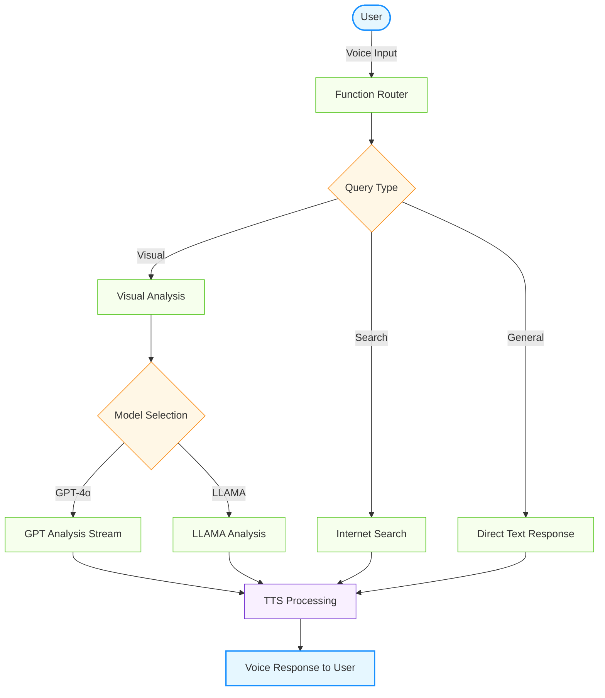

<div align="center">

# ✨ Envision AI ✨

### An Advanced Voice & Vision Assistant for Blind and Visually Impaired Users

*Bridging the visual gap through AI-powered assistance*

</div>

---

## 📋 Overview

Envision AI combines cutting-edge speech recognition, natural language processing, and computer vision to create an intuitive assistant specifically designed for blind and visually impaired users. This thoughtfully crafted solution helps users better understand their surroundings and interact with the world more confidently and independently.

---

## 🏗️ System Architecture

The system utilizes an elegant multi-component architecture to process user inputs and generate helpful responses:



---

## ✨ Key Features

### 🔄 Dual Vision Model Approach
* **People Detection First:** Llama-4-Scout-17B checks for presence of people
* **Conditional Processing:** GPT-4o for scenes without people, Llama for scenes with people
* **Privacy-Aware:** Thoughtful descriptions while respecting privacy

### 🌊 Real-time Response Streaming
* Progressive output for improved user experience
* Natural conversational flow with minimal latency
* Immediate feedback during interaction

### 👁️ Blind/Low-Vision Optimizations
* **Detailed Descriptions:** Prioritizes key elements for visually impaired users
* **Voice-First Design:** Intuitive speech interface reduces barriers
* **Concise Analysis:** Thorough yet efficient scene descriptions

### 🧩 Comprehensive Capabilities
* **Voice Interaction:** Natural conversation using speech
* **Visual Understanding:** Camera-based vision to describe surroundings
* **Internet Search:** Real-time information lookup
* **Seamless Integration:** Coordinated operation between components

---

## 🔧 Technical Implementation

### Model Selection

We carefully selected `meta-llama/llama-4-scout-17b-16e-instruct` as our primary people detection model based on:

| Criteria | Performance |
|:---------|:------------|
| Response Time | TTFT < 150ms (well below 500ms requirement) |
| Batch Processing | Handles 10+ consecutive image queries without degradation |
| Streaming | Provides token-by-token streaming for responsive UX |
| People Recognition | Reliably identifies presence of people in images |
| Image Limits | 4MB (base64), 20MB (URL), multiple images supported |
| Success Rate | >95% in testing |

### Groq API Integration

The Groq API powers our Llama model implementation when people are detected in scenes:

* **⚡ Fast Processing:** Sub-500ms TTFT meets accessibility requirements
* **🧠 Advanced Models:** Leverages state-of-the-art Llama 4 Scout capabilities
* **🔌 Simple Integration:** Clean API with official Python client library

---

## 🗂️ Project Structure

```
Envision-AI/
├── app.py                  # Main entry point
├── requirements.txt        # Dependencies
├── .env                    # Environment variables (not committed)
├── images/                 # Images and diagrams
└── src/
    ├── main.py             # Agent implementation
    ├── config.py           # Configuration handling
    └── tools/
        ├── visual.py       # Visual processing pipeline
        ├── groq_handler.py # Groq API integration
        └── internet_search.py # Web search functionality
```

---

## 🚀 Getting Started

### Prerequisites

* **Python 3.9+** - Core programming language
* **LiveKit API** - For real-time communication
* **OpenAI API** - For GPT-4o capabilities
* **Deepgram API** - For speech-to-text functionality
* **ElevenLabs API** - For text-to-speech synthesis
* **Groq API** - For fallback vision processing

### Installation

<details>
<summary><b>1. Clone the repository</b></summary>

```bash
git clone https://github.com/codingaslu/Envision-AI.git
cd Envision-AI
```
</details>

<details>
<summary><b>2. Set up environment</b></summary>

```bash
python -m venv venv
source venv/bin/activate  # On Windows: venv\Scripts\activate
pip install -U pip
pip install -r requirements.txt
```
</details>

<details>
<summary><b>3. Configure environment variables</b></summary>
   
Create a `.env` file with the following:
```
LIVEKIT_URL=your_livekit_url
LIVEKIT_API_KEY=your_livekit_key
LIVEKIT_API_SECRET=your_livekit_secret
DEEPGRAM_API_KEY=your_deepgram_key
OPENAI_API_KEY=your_openai_key
ELEVEN_API_KEY=your_elevenlabs_key

# Vision configuration
VISION_PROVIDER=groq

# Groq API configuration
GROQ_API_KEY=your_groq_api_key
GROQ_MODEL_ID=meta-llama/llama-4-scout-17b-16e-instruct
```
</details>

### Running the Application

| Step | Command | Description |
|:-----|:--------|:------------|
| 1 | `python app.py download-files` | Download dependencies |
| 2a | `python app.py start` | Start in standard mode |
| 2b | `python app.py dev` | Start in development mode |
| 3 | Connect via [LiveKit playground](https://agents-playground.livekit.io/) | Begin interaction |

---

## 🛠️ Implementation Details

### Core Components

#### 🎙️ Voice Pipeline
* **STT:** Deepgram for real-time speech-to-text conversion
* **TTS:** ElevenLabs for natural-sounding text-to-speech

#### 🧠 Language Processing
* **Primary LLM:** OpenAI GPT-4o for conversational intelligence
* **Function Routing:** Dynamic selection of appropriate capabilities

#### 👁️ Vision Processing
* **People Detection:** Llama-4-Scout-17B to determine presence of people
* **Scene Analysis:** GPT-4o for scenes without people, Llama for scenes with people

---

## 🧩 Challenges and Solutions

### Privacy-Preserving Vision

**Challenge:** GPT-4o sometimes refuses to describe people in images due to privacy guardrails.

**Solution:**
1. Llama model first checks for presence of people in images
2. Route to appropriate model based on content (GPT-4o for no people, Llama for people)
3. Response normalization for consistent user experience

### Performance Optimization

**Approaches:**
* ⚡ Efficient API client configuration
* 🖼️ Image preprocessing and optimization
* ⏱️ Parallel processing where appropriate
* 🌊 Response streaming for immediate feedback

---

## 📊 Performance and Limitations

| Aspect | Details |
|:-------|:--------|
| Connectivity | Requires stable internet connection |
| API Rate Limits | Subject to provider limitations |
| Image Size | Max 4MB (base64), 20MB (URL) |
| Context Window | 128K tokens in preview |

---

## 🔮 Future Roadmap

| Planned Feature | Description |
|:----------------|:------------|
| 🖼️ Advanced preprocessing | Enhanced image optimization pipeline |
| 🗺️ Location integration | Google Maps integration for location context |
| 🌤️ Environmental data | Weather, distance, and temporal information |
| 📅 Calendar features | Scheduling and appointment assistance |
| 📱 Code recognition | QR and barcode detection and processing |
| ⚡ Performance upgrades | Response caching for improved speed |
| 🎞️ Sequential analysis | Multi-image sequence processing |
| 🎙️ Voice personalization | Customizable voice profile selection |

---

## 📄 License

This project is proprietary and confidential. All rights reserved.

---

## 👏 Acknowledgments

* **LiveKit** - WebRTC infrastructure
* **OpenAI** - GPT-4o capabilities  
* **Groq** - Llama model API access
* **Deepgram** - Speech recognition technology
* **ElevenLabs** - Voice synthesis technology

---

<div align="center">

## 📞 Support

For issues or questions, please contact:

**Email:** muhammedaslam179@gmail.com  
**GitHub:** [Open an Issue](https://github.com/codingaslu/Envision-AI/issues)

</div>
